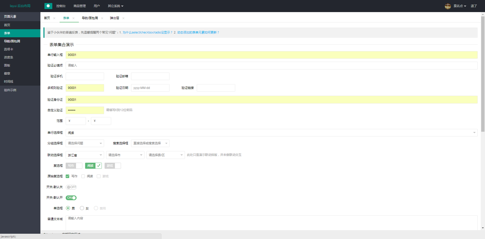
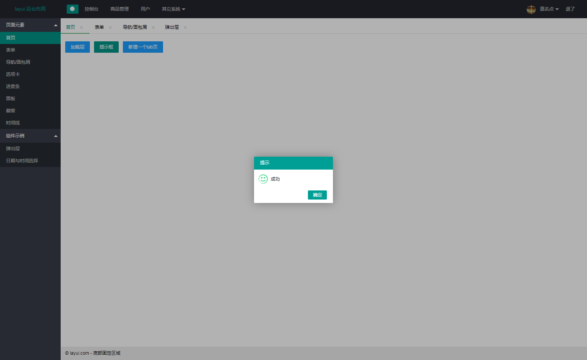

### :point_right: 后台管理系统模板 :point_left:

感觉还可以的就star一下哦！！！！！！

刚刚贤心大佬刚更新了layui 2.4.0++，






使用这个模板，要了解angular1.x 这个mvvm框架的基本使用方法；

这里使用AMD的规范

r.js 打包

layui css框架

当然还有jquery

首先到项目目录
```javascript

npm install || cnpm install //（cnpm 为淘宝镜像大家都懂的）

```
运行 
```javascript

npm run start 

```
生产打包

```javascript

npm run build

```
作者 : 丁永亚</br>
---
邮箱  :  yahya_dyy@163.com
----

## 📜 License
Copyright (c) 2018 09 http://github.com/dyywork

The MIT License